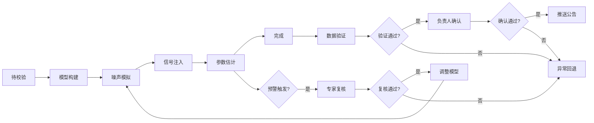
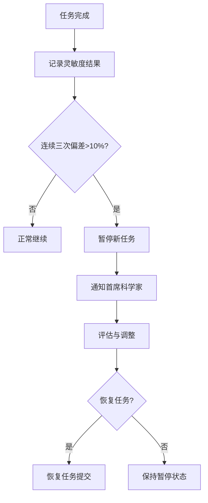
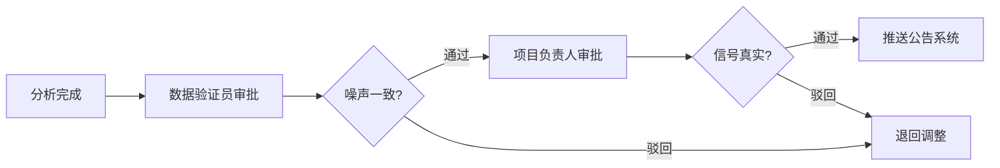

## 1. 产品概述

引力波探测器干涉仪噪声模拟与天体源参数估计平台，面向引力波数据分析研究人员，提供从探测器设计参数上传、噪声模型构建、干涉仪响应模拟、信号注入、参数估计到结果报告的全流程分析能力。平台内置智能工作流引擎，支持多级预警、专家复核、两级审批和质量监控，确保分析结果的准确性与可靠性。

### 核心价值
- 自动化干涉仪噪声模拟与参数估计流程，提升科研效率
- 实时监控灵敏度与信噪比，保障分析质量
- 完整的审批追溯体系，满足科研规范要求
- 智能推荐与历史数据分析，优化分析策略

## 2. 核心功能

### 2.1 用户角色

| 角色 | 说明 | 核心权限 |
|------|------|----------|
| 数据分析员 | 主要使用者，执行模拟分析任务 | 上传参数、创建任务、查看结果、导出数据 |
| 数据验证员 | 负责噪声一致性验证 | 验证任务、提交审批、查看预警 |
| 项目负责人 | 负责信号真实性确认 | 审批任务、查看报告、管理配置 |
| 引力波专家 | 负责异常情况复核 | 复核预警、调整模型、记录日志 |
| 首席科学家 | 质量管理与全局监控 | 查看全局统计、处理质量告警、管理用户 |

### 2.2 功能模块

1. **综合看板**：任务统计、性能趋势、质量监控、快捷操作
2. **任务管理**：任务列表、任务详情、状态流转、任务创建
3. **模拟分析**：参数上传、模型构建、噪声模拟、信号注入、参数估计
4. **结果报告**：灵敏度曲线、噪声功率谱、信号波形、参数后验分布、PDF报告
5. **预警中心**：多级预警列表、预警详情、专家复核、调整日志
6. **审批流程**：待办审批、审批历史、两级审批流转
7. **数据导出**：按构型/版本/时间窗口导出响应数据和参数估计结果
8. **智能推荐**：滤波器模板推荐、参数扫描范围推荐
9. **系统配置**：探测器构型管理、噪声模型版本管理、阈值配置

### 2.3 页面详情

| 页面名称 | 模块名称 | 功能描述 |
|----------|----------|----------|
| 登录页 | 身份认证 | 账号密码登录、角色选择、记住登录 |
| 综合看板 | 统计概览 | 任务完成率、平均估计精度、计算耗时、质量告警数 |
| 综合看板 | 性能趋势图 | 近7/30天完成率趋势、精度趋势、耗时趋势 |
| 综合看板 | 快捷入口 | 新建任务、待办审批、最新预警、我的任务 |
| 任务列表 | 筛选查询 | 按状态、构型、时间、负责人筛选 |
| 任务列表 | 任务卡片 | 任务状态、进度条、关键参数、操作按钮 |
| 任务详情 | 状态时间线 | 各阶段状态流转记录、耗时统计 |
| 任务详情 | 参数配置 | 探测器参数、噪声模型、信号注入参数 |
| 任务详情 | 实时监控 | 灵敏度曲线图、信噪比监控、噪声平稳性检测 |
| 任务详情 | 结果展示 | 后验分布图表、参数估计值、置信区间 |
| 新建任务 | 参数上传 | 探测器设计参数文件上传、噪声模型文件上传 |
| 新建任务 | 配置确认 | 参数预览、信号源配置、计算资源配置 |
| 预警中心 | 预警列表 | 多级预警（一级/二级/三级）、预警类型、处理状态 |
| 预警中心 | 预警详情 | 预警原因、相关数据、专家复核记录、调整措施 |
| 审批中心 | 待办审批 | 待验证任务、待确认任务、审批操作 |
| 审批中心 | 审批历史 | 已审批任务列表、审批意见、审批时间 |
| 数据导出 | 导出配置 | 探测器构型选择、噪声模型版本、时间窗口选择 |
| 数据导出 | 导出任务 | 导出任务列表、下载链接、导出状态 |
| 智能推荐 | 推荐结果 | 最优滤波器模板、推荐参数扫描范围、置信度 |
| 系统配置 | 构型管理 | 探测器构型列表、新增/编辑构型 |
| 系统配置 | 阈值管理 | 信噪比阈值、偏差阈值、预警阈值配置 |

## 3. 核心流程

### 3.1 分析任务主流程

用户上传探测器设计参数和噪声模型文件，系统进入待校验状态；校验通过后自动构建干涉仪响应模型并初始化光子计数统计；随后依次执行噪声模拟、信号注入、参数估计，过程中实时监控灵敏度曲线和信噪比；若触发预警则推送专家复核，复核通过后调整模型重新计算；参数估计完成后进入数据验证员审批，验证通过后提交项目负责人确认；两级审批通过后推送至天文事件公告系统，任务完成。

### 3.2 质量监控流程

系统对同一探测器构型的连续三次模拟结果进行灵敏度假定偏差检测，当偏差超过10%时自动暂停新任务并通知首席科学家，经评估后决定是否恢复任务或调整参数。

### 3.3 两级审批流程

参数估计完成后，首先由数据验证员验证噪声一致性，验证通过后提交项目负责人确认信号真实性，两级均通过后方可推送公告。

## 4. 用户界面设计

### 4.1 设计风格

**设计方向：科技深空风格**
- 以深空蓝黑色为主色调，营造引力波探测的神秘感与科技感
- 青色/蓝绿色作为数据高亮色，模拟星空观测的视觉体验
- 数据可视化采用暗色系图表，减少视觉疲劳
- 卡片采用半透明玻璃拟态效果，层次分明

**色彩系统：**
- 主色：深空蓝 `#0a1628`
- 次色：星空青 `#00d4ff`
- 强调色：信号橙 `#ff6b35`（预警）、确认绿 `#00ff88`（通过）
- 背景：渐变深蓝到黑，点缀星点纹理

**字体与排版：**
- 标题字体：使用等宽科技感字体，增强专业感
- 正文字体：清晰易读的无衬线字体
- 数据展示：等宽字体，确保数字对齐

**交互风格：**
- 按钮：微圆角、悬浮发光效果
- 卡片：细边框、半透明背景、悬浮上浮动效
- 图表：数据点发光、曲线平滑过渡动画
- 状态流转：时间线式进度展示

### 4.2 页面设计概览

| 页面名称 | 模块名称 | UI元素 |
|----------|----------|--------|
| 综合看板 | 统计概览 | 四个数据卡片（完成率、精度、耗时、告警），带趋势小图 |
| 综合看板 | 性能趋势 | 大面积折线图区域，可切换时间维度 |
| 综合看板 | 快捷入口 | 图标化快捷操作区，带悬浮动效 |
| 任务列表 | 任务卡片 | 卡片式列表，左侧状态色条，中间信息，右侧操作 |
| 任务详情 | 状态时间线 | 垂直时间线，节点带状态图标和时间 |
| 任务详情 | 实时监控 | 双栏布局，左灵敏度曲线，右信噪比监控 |
| 任务详情 | 后验分布 | 网格布局的分布图，支持缩放查看 |
| 预警中心 | 预警列表 | 三级色标（红/橙/黄）的列表，带处理状态标签 |
| 审批中心 | 待办审批 | 卡片堆叠布局，带审批操作按钮组 |

### 4.3 响应性

采用桌面端优先设计，针对科研工作者的大屏工作环境优化。同时适配平板尺寸，确保在会议室展示时的可用性。主要交互区域保持在1200px-1600px宽度范围内。

- 大屏（>1440px）：三栏布局，最大化信息展示
- 中屏（1024-1440px）：两栏布局，侧边栏可收起
- 小屏（<1024px）：单栏流式布局，顶部导航折叠

### 4.4 数据可视化设计

- **灵敏度曲线**：对数坐标轴，平滑曲线，带设计灵敏度参考线
- **噪声功率谱**：频域对数图，多种噪声分量叠加展示
- **信号波形**：时域波形图，注入信号与噪声叠加对比
- **参数后验分布**：角图（corner plot）展示参数联合分布
- **性能趋势**：多指标折线图，支持区间选择
