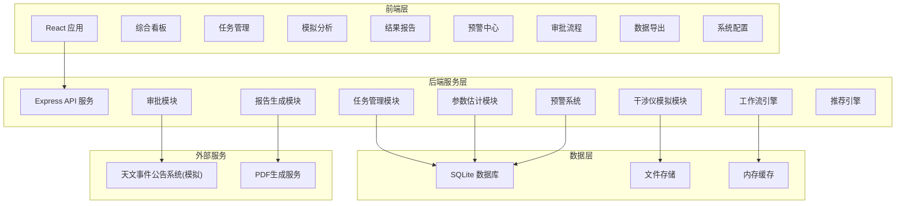
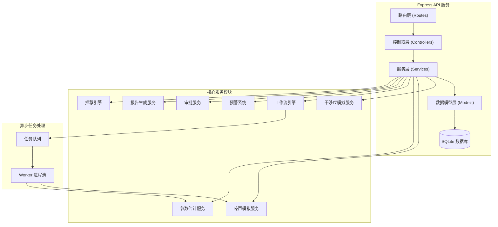
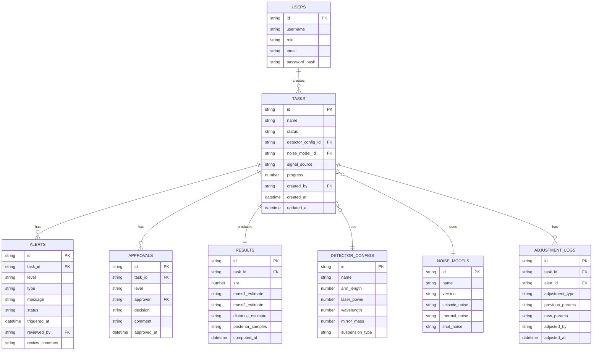

## 1. 架构设计

整体采用前后端分离架构，前端使用 React + TypeScript + Vite 构建，后端使用 Express + TypeScript 提供 API 服务。数据层使用 SQLite 存储任务数据和配置信息，配合内存缓存提升性能。物理模拟与参数估计算法封装在后端服务层，支持异步任务队列处理。



## 2. 技术描述

### 2.1 技术栈

| 层级 | 技术选型 | 说明 |
|------|----------|------|
| 前端框架 | React 18 + TypeScript | 组件化开发，类型安全 |
| 构建工具 | Vite 5 | 快速开发构建 |
| 状态管理 | Zustand 4 | 轻量级状态管理 |
| 路由 | React Router 6 | 单页应用路由 |
| UI样式 | TailwindCSS 3 | 原子化CSS |
| 图表库 | ECharts 5 | 数据可视化 |
| 后端框架 | Express 4 + TypeScript | RESTful API |
| 数据库 | SQLite 3 + better-sqlite3 | 轻量关系型数据库 |
| 文件处理 | multer | 文件上传处理 |
| PDF生成 | pdfkit | PDF报告生成 |
| 数值计算 | mathjs | 数学运算支持 |

### 2.2 项目结构

```
/
├── src/                      # 前端源码
│   ├── components/           # 公共组件
│   │   ├── charts/           # 图表组件
│   │   ├── layout/           # 布局组件
│   │   └── ui/               # UI基础组件
│   ├── pages/                # 页面组件
│   │   ├── Dashboard/        # 综合看板
│   │   ├── Tasks/            # 任务管理
│   │   ├── Analysis/         # 模拟分析
│   │   ├── Report/           # 结果报告
│   │   ├── Alerts/           # 预警中心
│   │   ├── Approval/         # 审批流程
│   │   ├── Export/           # 数据导出
│   │   └── Settings/         # 系统配置
│   ├── hooks/                # 自定义Hooks
│   ├── utils/                # 工具函数
│   ├── store/                # 状态管理
│   ├── types/                # 类型定义
│   └── App.tsx               # 应用入口
├── api/                      # 后端源码
│   ├── controllers/          # 控制器层
│   ├── services/             # 服务层
│   │   ├── interferometer.ts # 干涉仪模拟服务
│   │   ├── noise.ts          # 噪声模拟服务
│   │   ├── estimation.ts     # 参数估计服务
│   │   ├── workflow.ts       # 工作流引擎
│   │   ├── alert.ts          # 预警服务
│   │   ├── approval.ts       # 审批服务
│   │   ├── report.ts         # 报告服务
│   │   └── recommend.ts      # 推荐引擎
│   ├── models/               # 数据模型
│   ├── routes/               # 路由定义
│   ├── middleware/           # 中间件
│   ├── db/                   # 数据库相关
│   └── index.ts              # 服务入口
├── shared/                   # 共享类型
├── public/                   # 静态资源
└── uploads/                  # 上传文件存储
```

## 3. 路由定义

### 3.1 前端路由

| 路由路径 | 页面名称 | 说明 |
|----------|----------|------|
| /login | 登录页 | 用户身份认证 |
| /dashboard | 综合看板 | 统计概览与快捷入口 |
| /tasks | 任务列表 | 任务查询与管理 |
| /tasks/new | 新建任务 | 创建分析任务 |
| /tasks/:id | 任务详情 | 任务监控与结果查看 |
| /alerts | 预警中心 | 预警列表与处理 |
| /approval | 审批中心 | 待办审批与历史 |
| /export | 数据导出 | 数据配置与导出 |
| /recommend | 智能推荐 | 推荐结果展示 |
| /settings/detectors | 构型管理 | 探测器构型配置 |
| /settings/thresholds | 阈值管理 | 系统阈值配置 |

### 3.2 API 路由

| 路由 | 方法 | 功能 |
|------|------|------|
| /api/auth/login | POST | 用户登录 |
| /api/tasks | GET | 获取任务列表 |
| /api/tasks | POST | 创建任务 |
| /api/tasks/:id | GET | 获取任务详情 |
| /api/tasks/:id/status | PUT | 更新任务状态 |
| /api/tasks/:id/results | GET | 获取任务结果 |
| /api/alerts | GET | 获取预警列表 |
| /api/alerts/:id/review | POST | 复核预警 |
| /api/approval/pending | GET | 获取待审批列表 |
| /api/approval/:id/approve | POST | 审批通过 |
| /api/approval/:id/reject | POST | 审批驳回 |
| /api/report/:id/pdf | GET | 生成PDF报告 |
| /api/export | POST | 创建导出任务 |
| /api/export/:id/download | GET | 下载导出文件 |
| /api/recommend/filter | GET | 获取滤波器推荐 |
| /api/recommend/param-range | GET | 获取参数范围推荐 |
| /api/detectors | GET | 获取探测器构型列表 |
| /api/detectors | POST | 新增探测器构型 |
| /api/stats/dashboard | GET | 获取看板统计数据 |
| /api/stats/trends | GET | 获取性能趋势数据 |
| /api/upload | POST | 文件上传 |

## 4. API 定义

### 4.1 核心数据类型

```typescript
// 任务状态枚举
enum TaskStatus {
  PENDING_VALIDATION = 'pending_validation',
  MODEL_BUILDING = 'model_building',
  NOISE_SIMULATION = 'noise_simulation',
  SIGNAL_INJECTION = 'signal_injection',
  PARAMETER_ESTIMATION = 'parameter_estimation',
  COMPLETED = 'completed',
  PENDING_VERIFICATION = 'pending_verification',
  PENDING_CONFIRMATION = 'pending_confirmation',
  APPROVED = 'approved',
  FALLBACK = 'fallback',
  ERROR = 'error'
}

// 预警级别
enum AlertLevel {
  LEVEL_1 = 'level1',  // 一级 - 严重
  LEVEL_2 = 'level2',  // 二级 - 重要
  LEVEL_3 = 'level3'   // 三级 - 注意
}

// 探测器参数
interface DetectorConfig {
  id: string;
  name: string;
  armLength: number;        // 臂长 (米)
  laserPower: number;       // 激光功率 (瓦)
  wavelength: number;       // 波长 (米)
  mirrorMass: number;       // 反射镜质量 (kg)
  suspensionType: string;   // 悬挂类型
  configuration: string;    // 构型描述
}

// 噪声模型
interface NoiseModel {
  id: string;
  name: string;
  version: string;
  seismicNoise: NoiseComponent;
  thermalNoise: NoiseComponent;
  shotNoise: NoiseComponent;
  radiationPressure: NoiseComponent;
}

interface NoiseComponent {
  type: string;
  parameters: Record<string, number>;
  spectrum: FrequencySeries;
}

// 频率序列数据
interface FrequencySeries {
  frequencies: number[];
  values: number[];
}

// 分析任务
interface AnalysisTask {
  id: string;
  name: string;
  status: TaskStatus;
  detectorConfigId: string;
  noiseModelId: string;
  signalSource: SignalSource;
  createdAt: string;
  updatedAt: string;
  createdBy: string;
  progress: number;
  currentStep: string;
}

// 信号源参数
interface SignalSource {
  type: 'BBH' | 'BNS' | 'NSBH';  // 双黑洞/双中子星/中子星黑洞
  mass1: number;                   // 天体1质量 (太阳质量)
  mass2: number;                   // 天体2质量 (太阳质量)
  spin1: number;                   // 天体1自旋
  spin2: number;                   // 天体2自旋
  distance: number;                // 距离 (Mpc)
  inclination: number;             // 倾角 (弧度)
}

// 参数估计结果
interface EstimationResult {
  taskId: string;
  mass1: ParameterEstimate;
  mass2: ParameterEstimate;
  spin1: ParameterEstimate;
  spin2: ParameterEstimate;
  distance: ParameterEstimate;
  snr: number;                      // 信噪比
  logLikelihood: number;
  posteriorSamples: PosteriorSamples;
}

interface ParameterEstimate {
  median: number;
  lower90: number;
  upper90: number;
  lower68: number;
  upper68: number;
}

interface PosteriorSamples {
  mass1: number[];
  mass2: number[];
  spin1: number[];
  spin2: number[];
  distance: number[];
}

// 预警记录
interface Alert {
  id: string;
  taskId: string;
  level: AlertLevel;
  type: 'low_snr' | 'non_stationary_noise' | 'sensitivity_deviation';
  message: string;
  triggeredAt: string;
  status: 'pending' | 'reviewed' | 'resolved';
  reviewedBy?: string;
  reviewComment?: string;
  adjustmentLog?: AdjustmentLog;
}

// 审批记录
interface ApprovalRecord {
  id: string;
  taskId: string;
  level: 'verification' | 'confirmation';
  approver: string;
  decision: 'approved' | 'rejected';
  comment: string;
  approvedAt: string;
}

// 看板统计
interface DashboardStats {
  totalTasks: number;
  completedToday: number;
  completionRate: number;
  avgEstimationAccuracy: number;
  avgComputationTime: number;
  activeAlerts: number;
  pendingApprovals: number;
}

// 性能趋势
interface TrendData {
  dates: string[];
  completionRate: number[];
  accuracy: number[];
  computationTime: number[];
}
```

## 5. 服务器架构图



## 6. 数据模型

### 6.1 数据模型定义



### 6.2 初始化数据

系统初始化时将创建以下数据：

1. **5个用户账号**：对应5种角色（数据分析员、数据验证员、项目负责人、引力波专家、首席科学家）
2. **3个探测器构型**：基础构型、高级构型、LIGO类构型
3. **2个噪声模型版本**：v1.0 基础噪声模型、v2.0 改进噪声模型
4. **5-8个示例任务**：覆盖不同状态的任务用于演示
5. **示例预警记录**：3条不同级别的预警
6. **审批记录**：对应示例任务的审批记录
7. **统计历史数据**：30天的性能趋势数据
